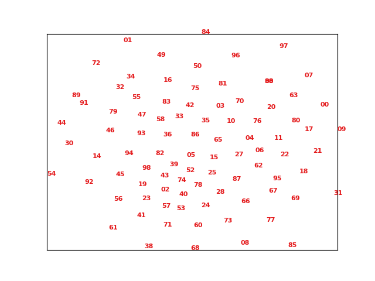

[TOC]

## **运行环境**

+ Ubuntu 16.04
+ Python 3.6.9
+ Pytorch: 1.9.0
+ torchvision: 0.8.0
+ CUDA: 10.2


## 依赖库

+ umap-learn >= 0.5.2
+ matplotlib >= 3.3.4
+ sklearn >= 0.0

依赖库安装：

```
pip install -r requirements.txt
```


## 报告

+ ### 任务目标

爬取大量轿车图片，用于后续任务（比如分类或检测使用）


+ ### 数据源

爬取图片均来自百度

如果有条件可以从 google 爬取


+ ### 爬取方式

  + [Image Downloader](https://github.com/sczhengyabin/Image-Downloader) 

    + 要求 Python3.5+

    + 需要安装 chrome 浏览器

    + 从[这里](https://chromedriver.chromium.org/downloads)下载系统对应的 chromedriver

    + 将可执行文件 `chromedriver` 拷贝到 ${project_directory}/bin/ 路径下或将其路径添加到环境变量 PATH.

    + 执行 image_downloader_gui.py 后出现图形界面

      ```
      python image_downloader_gui.py
      ```

      


+ ### 数据观察结果

  + 数据中有纯文字图片，完全没有汽车
  + 有些图片不止有一辆车
  + 有些图片只是车的内部
  + 有些图片上的汽车不易辨认


+ ### 筛选目标

  + 去掉完全没有汽车的图片，包括空白图片
  + 去掉汽车不是主体的图片
  + 去掉非真实汽车的图片，比如卡通图片等
  + 去掉像素质量低的图片
  + 去掉人眼不易识别的图片


+ ### 筛选方式

  + 初级筛选（img_filter/img_primary_filter.py）

    **筛选步骤：**

    + 基于文件信息筛选：

      1. 删除文件占存储空间比较小的（阈值需要先按文件大小排序再进行观察后确定）
      2. 删除尺寸过小的图片
      3. 删除高大于宽的图片（通过观察确定）

    + 基于图片信息筛选：

       删除 x/y 方向梯度变化很小的图片

      

    **执行方式：**

    ```
    ./img_filter/primary_filter.sh
    ```

    primary_filter.sh：

    ```shell
    #!/bin/bash
    
    ROOT_PATH='../download_images/car'
    FILE_SIZE_TH=10240
    WIDTH_TH=256
    HEIGHT_TH=256
    GRADIENT_TH=80
    
    python img_primary_filter.py \
    	--root_dir ${ROOT_PATH} \
    	--file_size_thred ${FILE_SIZE_TH} \
    	--width_thred ${WIDTH_TH} \
    	--height_thred ${HEIGHT_TH} \
    	--gradient_thred ${GRADIENT_TH}
    ```

    + 参数说明：
      + root_dir: 待筛选的数据集路径
      + file_size_thred：文件大小的阈值
      + width_thred：图片宽度阈值
      + height_thred：图片高度阈值
      + gradient_thred：图片梯度阈值

    

  + 高级筛选

    **筛选步骤：**

    + 利用 resnet50 网络提取图片在 fc 之前的特征（特征 shape: 7x7x512）
    + 计算得到特征的均值与方差
    + 对得到的特征进行降纬（降至2纬），使用 t-sne 或 Umap （sklearn 有库函数提供，可以直接使用）
    + 将降纬后的结果画图，观察图中位于最外圈的图片，这些图片可能为异常图片

    

    **执行方式：**

    ```
    ./img_filter/advanced_filter.sh
    ```

    advanced_filter.sh 文件：

    ```shell
    #!/bin/bash
    
    ROOT_PATH='../download_images/car'
    
    python img_advanced_filter.py \
    	--root_dir ${ROOT_PATH} \
    ```

    + 参数说明：
      + root_dir: 待筛选的数据集路径

    <font color='red'>注： 初级筛选和高级筛选出来的异常图片会存放在 remove 路径下</font>

  

+ ### 筛选结果

  + 通过初级筛选可以去掉一些明显异常的图片，比如空白图片和宽高明显不对的图片
  + 高级筛选结果可能需要观察后确定是否真的是异常

  

  t-sne  降维结果

  

  umap  降维结果

  

  

  总的来说，通过两种筛选确实可以去掉一些异常图片，筛选结果的准确率取决于爬取数据的分布，肯定不会全部剔除掉异常图片，仍然需要人工进一步筛选。

  


